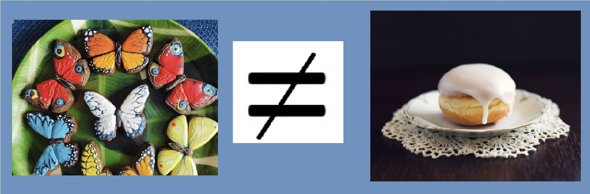
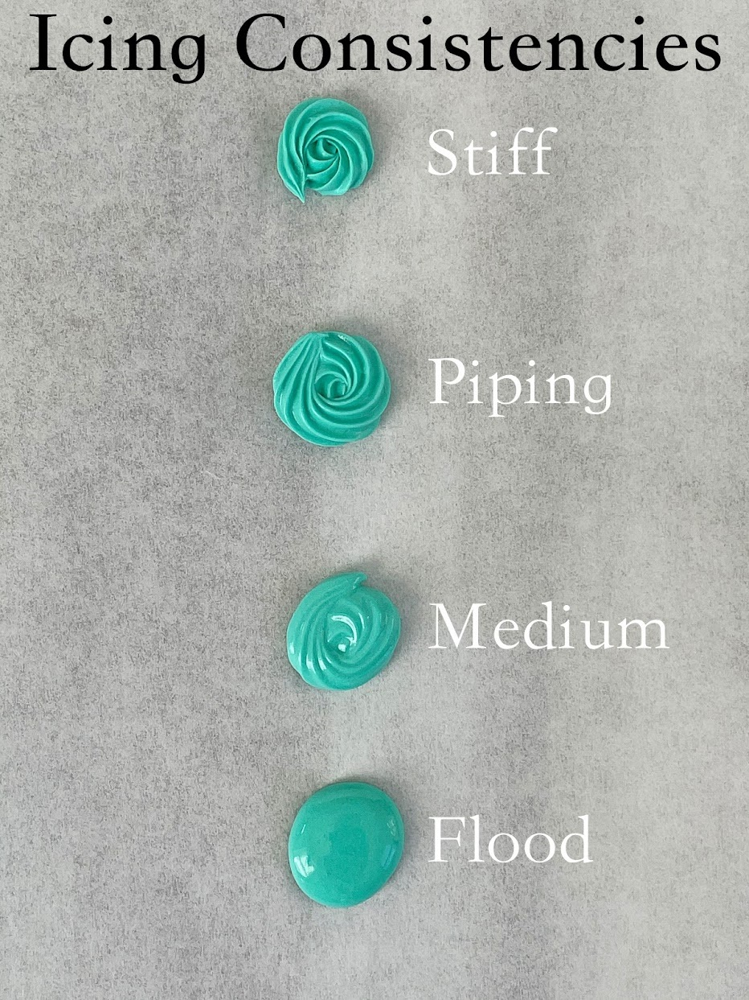

# A very short (and still uncompleted) guide to Royal Icing.<!-- omit in toc -->

- [What is Royal Icing?](#what-is-royal-icing)
- [How to prepare Royal Icing?](#how-to-prepare-royal-icing)
- [Short summary of Royal Icing consistencies:](#short-summary-of-royal-icing-consistencies)

## What is Royal Icing?
  
Royal Icing ("*lukier królewski*" in Polish) is, simply speaking, a mixture of powdered sugar and raw egg whites. It hardens when cooled, making it a great choice for decorated cookies and gingerbread houses.     

>**Do not confuse it with plain frosting** you can see on Polish doughnuts ("*pączki*") or cakes in confectioneries or bakeries. They are similar, but not the same, and have different properties.

## How to prepare Royal Icing?

It's actually uncomplicated:

1. If you are beginner, don't search too much on the Internet as it will make you confused. Leave it for later, when you get more experience. Purchase *2 or 3 packs of powdered sugar, 1 lemon** and *bottle of liquid egg whites**.  
Liguid egg whites are avaliable on [Allegro](https://allegro.pl/), in stores for confectioners like [The cakes](https://thecakes.pl/pl) or [Torty Torty](https://tortytorty.pl) or stores with dietary supplements and nutrients for active people like [KFD](https://sklep.kfd.pl), [SFD](https://sklep.sfd.pl), [Świat supli](https://swiatsupli.pl) etc. Personally, I use and recommend liquid whites from [Farma Białka](https://farmabialka.pl).

Why not usual whites directly from an egg? **In order to avoid Salmonella infection**. Liquid egg whites are pasteurised, so there's no risk involved. They are easier to work with - packed in a convinient bottle, so there is **no sloppy separating egg yolks from whites**. What's more, you take only as much as you need - you can freeze the rest for later use.

2.  Prepare a large bowl and a hand mixer - unfortunately, I don't have a KitchenAid or similar food processor, but if you are a happy owner of that kind of appliance, feel free to use it.  
Remember: there is no strict formula for preparing the Royal Icing like `X + Y = Z` and you have to use ingredients by feel (for Polish-speaking readers: *wiem, "na oko to chłop w szpitalu umarł"* 🤪🤪)

3. **To be continued...**
  
  
## Short summary of Royal Icing consistencies:

|No. |Type |Description |Use|
|:----:|:----:|--------------|---------------|
|1 |Stiff |The consistency you get right out of the mixer |Making flowers or similar objects and decorations that need to perfectly hold their shape|
|2 |Piping |Resembles toothpaste being squeezed from a tube |Outlining, lettering, detailing, line work|
|3 |Medium |More liquid than piping consistency, but still holds its shape |Outlining and flooding with one consistency, creating puffy areas|
|4 |Flood |As the name suggests, it floods - like honey, for example |Flooding, wet-on-wet technique|
  
On the picture below you can see the examples of mentioned icing consistencies:  

.